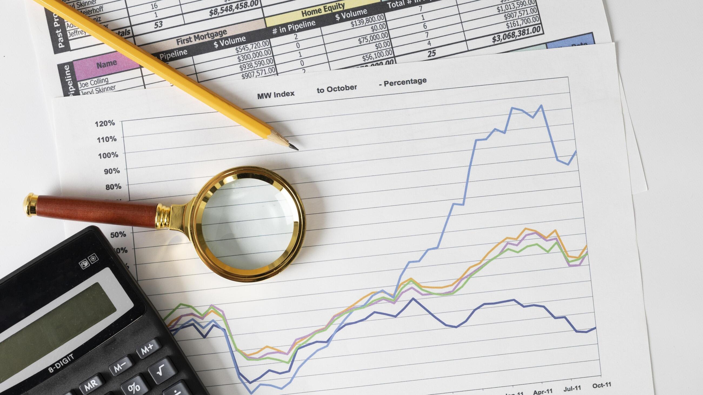

# 📑 Personal_Expenses_Tracker

----

### A beginner-friendly Python project that helps me log, categorize, and analyze my monthly expenses, giving me a clear picture of where my money goes.

## 📌 Project overview 

Learning the Python basics and applying them to something practical that allows me to:
- Record each expense with an item, amount, category, and is_necessary. 
- Organize spending into categories (Food, Transport, Utilities, Basic, Healthcare etc.)  
- Build financial awareness by showing where my money is going.

##  🛠 What I Used

In building this project, I practiced and applied:

Variables → to store expense details like amount, category, and date

Data Types → numbers (int/float), text (strings), True (boolean) ,and dates

Data Structures → lists to organize and group expenses, using indexing to sum up prices

This is my first step toward applying Python in real-life projects while improving my coding and financial tracking skills.

## 💰 How to Run the project:
- Clone this Repository:
  https://github.com/latifat-Oluwakemi-Hassan/Personal_Expenses_Tracker.git
